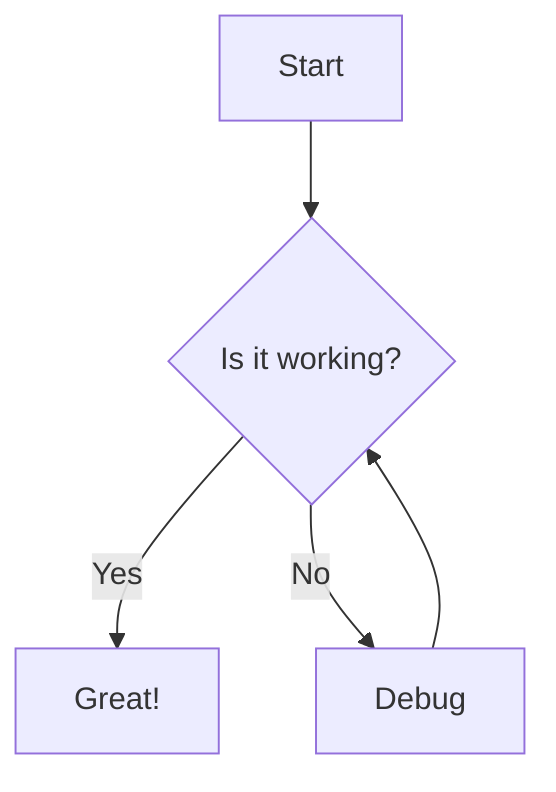

# Advanced Features Example

This example showcases advanced features of both Docsify and Tiny File Manager in a real-world documentation scenario.

## Multi-language Documentation Example

### Directory Structure
```
docs/
├── README.md
├── _navbar.md
├── en/
│   ├── README.md
│   └── guide.md
└── zh-cn/
    ├── README.md
    └── guide.md
```

### _navbar.md Configuration
```markdown
* Language
  * [:uk: English](/)
  * [:cn: 中文](/zh-cn/)
```

## Custom Themes and Plugins

### Custom Theme Example
```html
<style>
:root {
  --theme-color: #42b983;
  --sidebar-width: 300px;
}

.sidebar {
  background-color: #f8f8f8;
}

.markdown-section {
  max-width: 800px;
  padding: 30px;
}
</style>
```

### Plugin Integration
```html
<!-- Search -->
<script src="//cdn.jsdelivr.net/npm/docsify/lib/plugins/search.min.js"></script>

<!-- Syntax Highlighting -->
<script src="//cdn.jsdelivr.net/npm/prismjs@1/components/prism-bash.min.js"></script>
<script src="//cdn.jsdelivr.net/npm/prismjs@1/components/prism-php.min.js"></script>

<!-- Copy to Clipboard -->
<script src="//cdn.jsdelivr.net/npm/docsify-copy-code"></script>
```

## Interactive Documentation Example

### API Console Integration
```html
<div class="api-console">
  <iframe src="https://api-console.example.com" 
          width="100%" 
          height="500px" 
          frameborder="0">
  </iframe>
</div>
```

### Embedded Diagrams
```markdown
<!-- Using Mermaid -->


## Version Control Integration

### Directory Structure with Versions
```
docs/
├── v1/
│   ├── README.md
│   └── api-reference.md
├── v2/
│   ├── README.md
│   └── api-reference.md
└── _sidebar.md
```

### Version Selector
```html
<select onchange="window.location.href=this.value">
  <option value="/v2/">v2.0 (Latest)</option>
  <option value="/v1/">v1.0</option>
</select>
```

## Advanced Search Configuration

```javascript
window.$docsify = {
  search: {
    maxAge: 86400000,
    paths: [
      '/',
      '/guide',
      '/get-started',
      '/zh-cn/',
      '/zh-cn/guide'
    ],
    placeholder: {
      '/zh-cn/': '搜索',
      '/': 'Type to search'
    },
    noData: {
      '/zh-cn/': '找不到结果',
      '/': 'No Results'
    },
    depth: 6
  }
}
```

## File Management Tips

### Batch Operations with Tiny File Manager

1. **Mass Upload**
   - Select multiple files
   - Maintain structure
   - Process in batches

2. **Backup Strategy**
   ```
   docs-backup/
   ├── daily/
   ├── weekly/
   └── monthly/
   ```

3. **Permission Management**
   ```
   docs/
   ├── public/     # Everyone can read
   ├── internal/   # Team only
   └── admin/      # Administrators only
   ```

## SEO Optimization

### robots.txt Example
```txt
User-agent: *
Allow: /
Disallow: /private/
Sitemap: https://docs.example.com/sitemap.xml
```

### Meta Tags
```html
<meta name="description" content="Official documentation">
<meta name="keywords" content="api, docs, reference">
```

## Analytics Integration

```html
<!-- Google Analytics -->
<script>
window.$docsify = {
  ga: 'UA-XXXXX-Y'
}
</script>
<script src="//cdn.jsdelivr.net/npm/docsify/lib/plugins/ga.min.js"></script>
```

These examples demonstrate advanced usage of both Docsify and Tiny File Manager in a production environment. They can be customized and extended based on specific needs.
